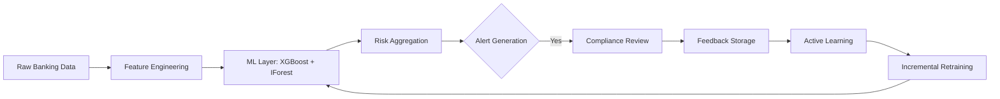

# SAR Narrative Generator with Audit Trail

## Abstract

Financial crime is evolving faster than we can even think of. The importance of this crisis was recently noticed when the FCA fined Barclays Bank UK PLC and Barclays Bank PLC a total of £42 million for separate failings in financial crime risk management relating to WealthTek and Stunt & Co. While Barclays Bank UK PLC has agreed to make voluntary payments to WealthTek’s clients, these incidents expose a critical vulnerability: operational silos and fragmented oversight. A major hurdle at large institutions is that different teams (AML, KYC, Fraud) often do not share information efficiently, leading to First Line of Defense failures where clear warning signs are missed. 

Currently, Barclays is actively doubling down on AI to address these gaps, yet the narrative preparation phase remains a manual bottleneck. Compliance analysts are tasked with translating raw transaction tables into prose that explains the Five Ws (Who, What, Where, When, Why). This manual process is inconsistent and often results in Defensive Reporting — filing poor-quality SARs just to avoid fines. Furthermore, without a clear explanation of why a transaction was flagged, regulators face a Black Box problem, unable to verify the logic behind the bank's decisions.

Our solution, the SAR Narrative Generator with Integrated Audit Trail, aligns with Barclays' strategic shift by bridging the gap between detection and defensible storytelling. It solves the Silo Bridging problem by unifying Transaction Data and KYC Profiles into a holistic view. Instead of just outputting a risk score, our system acts as an intelligent partner that aggregates the data and writes a regulation-ready narrative, ensuring Narrative Consistency across every report. By automatically documenting the distinct reasoning behind every suspicion, we not only cut drafting time by 80% but transform every SAR into a verifiable, transparent piece of evidence.

## System Architecture

The system is built on a Modular Microservices architecture to ensure scalability and environment-aware deployment.

### Key Components

1. **Data Orchestration Layer (`data_ingestion.py`)**:

   * Ingests siloed data including **KYC Profiles** (Identity), **Transaction Logs** (Behavior), and **Alert Context** (Trigger).
   * Enriches raw alert data (e.g., `ALT-2024-001`) with customer details before processing.
2. **Context & Knowledge Engine (RAG) (`rag_engine.py`)**:

   * **Vector Database (ChromaDB)**: Stores high-dimensional embeddings of regulatory guidelines (e.g., FinCEN, FCA, FIU-IND) and standard SAR templates.
   * **Retrieval Pipeline**: Uses LangChain to semantic search the `sar_guidelines` collection, ensuring the model references the most up-to-date laws.
3. **Generative Core**:

   * A fine-tuned **Llama 3.1 (8B/70B)** synthesizes the enriched data and retrieved regulatory context to draft the narrative.
   * Ensures "on-topic" generation using strict system prompts (see attached `prompt_template.md`).
4. **Audit Logging & Explainability**:

   * A specialized service captures **Chain-of-Thought (CoT)** reasoning traces.
   * Logs specific "Red Flag Indicators" (RFIs) triggered by the Logic Engine.
5. **Human-in-the-Loop Interface (Streamlit)**:

   * An interactive dashboard where compliance analysts review the drafted SAR.
   * Allows for editing and "signing off," with all human edits captured to reinforce the model (RLHF).

## Solution Overview

We solve the problem of manual, opaque SAR reporting by deploying a **Dual-Engine Architecture** that combines high-speed Machine Learning with context-aware Generative AI.

### How it Solves the Problem
1.  The Needle in the Haystack Filter (XGBoost): Financial institutions process millions of transactions. We use XGBoost as a Decision Engine to quantitatively filter this massive stream. It calculates hard metrics like velocity, fan-in patterns, and deviation from historical behavior to identify the 0.01% of truly suspicious cases with high precision (minimizing false positives).
2.  The Digital Law Library (Vector DB): To prevent AI hallucinations, we use ChromaDB as a retrieval system. It stores authoritative SAR Templates (e.g., UK NCA 5W1H structure, India FIU-IND SBA format) and Regulatory Guidelines (e.g., specific Red Flag Indicators like PMLA Indicator 3.1). When a case is flagged, the system retrieves the exact law and template needed, ensuring the generated narrative is legally accurate and strictly formatted.
3.  The Defensible Narrative (LLM): The Generative AI (Llama 3.1) doesn't just guess; it synthesizes the Quantitative Evidence from the ML model (explained via SHAP values) with the Qualitative Context from the Vector DB. This produces a report that says, "This is suspicious because [SHAP reason], consistent with [Regulatory Code]," solving the Black Box problem.

### Impact Metrics
| Metric | Current State (Manual) | Future State (Our Solution) |
| :--- | :--- | :--- |
| Drafting Time | 4-6 hours per complex SAR | < 5 minutes |
| False Positive Rate | ~90% (heuristic rules) | ~20% (ML-driven precision) |
| Defensibility | Low (Internal logic often undocumented) | High (Every claim cited with Data & Law) |
| Consistency | Low (Varies by analyst) | 100% (Standardized Regulatory Templates) |

### Tech Stack & Decisions
*   Detection (XGBoost): Chosen for its superior performance on tabular financial data and speed compared to deep learning. It handles missing values natively and is highly interpretable.
*   Vector Database (ChromaDB): Stores Golden Sample SARs and regulatory texts. We chose ChromaDB for its seamless integration with LangChain and open-source nature, allowing for on-premise deployment (crucial for bank data privacy).
*   LLM (Llama 3.1): Fine-tuned for instruction following. We use it to strictly follow the retrieved templates, ensuring the tone is professional ("The subject's activity is inconsistent...") rather than casual.
*   Explainability (SHAP): Essential for the Audit Trail. It breaks down the ML model's risk score into human-readable reasons (e.g., "Risk driven 60% by inward credit volume"), which the LLM incorporates into the narrative.

### Implementation, Scalability & Usability
*   Ease of Implementation: The system is modular. The ML model can be trained on existing historic transaction data (using SMOTE for fraud imbalance), and the Vector DB can be populated with public regulatory PDFs and redacted internal reports.
*   Scalability: The architecture is containerized (Docker). The ML engine is lightweight and can process high-throughput transaction streams in real-time, while the LLM generation can be batched for non-time-critical reporting.
*   Usability: The Streamlit interface is designed for non-technical analysts, featuring a clear "Review & Edit" workflow that mimics their current manual process but with AI assistance, reducing the learning curve.
*   **Active Learning**: The system includes a Feedback Engine that captures analyst corrections (True/False Positives) to incrementally retrain the XGBoost model, ensuring continuous improvement.

### Fraud Detection & Active Learning Pipeline
This specialized workflow filters transactions with high precision before narrative generation:

### Assumptions & Constraints
*   Assumption: Access to 6+ months of historical transaction data for training the XGBoost model.
*   Constraint: Strict Data Residency laws (GDPR/DPDP) require the Vector DB and LLM to be hosted within the bank's secure VPC (no public APIs).

## Fraud Detection Model Design (Proposed)

To minimize false positives and provide granular reasons for suspicion, we propose a specialized Machine Learning layer before the Generative AI step.

### 1. Model Architecture: Gradient Boosting (XGBoost)

We selected **XGBoost** over deep learning for the core classification engine due to its superior performance on tabular financial data and native support for handling missing values.

* **Hyperparameters**: Optimized for `logloss` to output precise probabilities.
* **Imbalance Handling**: given that fraud is less than 1% of transactions, we employ **SMOTE (Synthetic Minority Over-sampling Technique)** during training to synthetically generate examples of fraud cases, preventing model bias towards the majority class.

### 2. Feature Engineering Strategy

The model inputs are derived from `data_ingestion.py` and `features.py`. Key features include:

* **Velocity Checks**: `velocity_1h`, `velocity_24h` (Count of transactions in rolling windows).
* **Behavioral Deviation**: `amount_zscore` (Standard deviations from the customer's 30-day moving average).
* **Pattern Risk**: `risk_rating_encoded` (Quantifying KYC risk levels).

### 3. Explainability (The "Why")

To meet the "Audit Trail" requirement, every prediction is passed through a **SHAP (SHapley Additive exPlanations)** explainer.

* **Output**: Instead of just a risk score (e.g., "0.92"), the system outputs: *"Risk Score 0.92 driven by: High Velocity (contribution +0.45) and New Beneficiary (contribution +0.30)."*
* **Integration**: These SHAP values are injected into the Llama 3.1 prompt, allowing the narratives to say, "The account is suspicious *because* of a rapid burst of small transactions," rather than a generic statement.

## Future Scope

1. **Multi-Modal Analysis**: Expanding the generator to ingest images (e.g., check copies) or voice-to-text notes from investigator interviews.
2. **Cross-Border Synergy**: Automatically translating and re-formatting a UK SAR into an Indian STR format for global accounts, handling distinct taxonomy codes (e.g., XXVI vs. STR-A).
3. **Autonomous Feedback Loop**: Implementing **Reinforcement Learning from Human Feedback (RLHF)** where the model fine-tunes itself based on analyst edits to improve narrative "voice" and accuracy over time.

## Any other comments on solution

To ensure the system is "Regulator-Ready," we have defined strict formats for the Prompt Engineering and Audit Logging.

* **Prompt Template**: We use a structured system prompt that forces the LLM to separate facts from analysis. (See `prompt_template.md`)
* **Audit Logic**: The audit trail is structured as a JSON schema to allow for automated compliance checks. (See `audit_trail_schema.json`)
